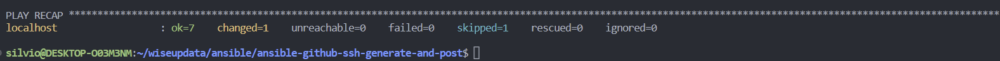

# **Generate the SSH keys and add to GitHub**

Go to home directory👍

Suggestion:

```
mkdir $HOME/wiseupdata/ansible/
cd $HOME/wiseupdata/ansible/
git clone https://github.com/wiseupdata/ansible-github-ssh-generate-and-post.git
cd $HOME/wiseupdata/ansible/ansible-github-ssh-generate-and-post/ && clear
```

> create the personal token with this instructions:
> https://docs.github.com/en/enterprise-server@3.4/authentication/keeping-your-account-and-data-secure/creating-a-personal-access-token
>
> - [X] write:public_key
> - [X] read:user

Export you credentials to the current terminal session:

````
export GITHUB_PERSONAL_ACCESS_TOKEN=your_personal_access_token
export GITHUB_EMAIL=your_email_address
````

Export you credentials to all terminal session:

````
cp ~/.bashrc ~/.bashrc-backup
cat ~/.bashrc-backup

echo " " >> ~/.bashrc
echo export GITHUB_PERSONAL_ACCESS_TOKEN=your_personal_access_token >> ~/.bashrc
echo export GITHUB_EMAIL=your_email_address >> ~/.bashrc
echo " " >> ~/.bashrc
source ~/.bashrc
cat ~/.bashrc
````

Check the creation:

```
echo $GITHUB_PERSONAL_ACCESS_TOKEN
echo $GITHUB_EMAIL
```

## Check the connection

```
ansible -i inventory/hosts.yml localhost -m ping  -v --extra-vars 'sudo_pass=$SUDO_PASS linux_user=$USER'
```


## Check in the Git portal

No credential created yet.
https://github.com/settings/keys


## Play the ansible

```
ansible-playbook site.yml -i inventory/hosts.yml -v --extra-vars 'sudo_pass=$SUDO_PASS linux_user=$USER'
```



# Reference

1. https://docs.github.com/en/enterprise-server@3.4/authentication/keeping-your-account-and-data-secure/creating-a-personal-access-token
